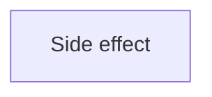

# Case Lab: Bio Plot Platform

> [!WARNING]
> Generated from the validated normalized knowledge graph. Do not edit this file directly.
> Regenerate with `python3 scripts/render-knowledge-map-markdown.py`.

Canonical case-lab hub: [Bio Plot Platform](../../case-labs/bio-plot-platform.md).

## Strict membership

| Concept | Kind | Reviewed capability | Legacy filename label | Summary |
| --- | --- | --- | --- | --- |
| [Side effect](../../concepts/side-effect.md) | foundation | unassessed | mastered | An observable change to execution or its environment caused by evaluation or an operation. |

## One-hop prerequisite context

No concepts match this view.

No contextual prerequisites are available without direct case-lab membership.

## Typed relationships

Back to [Knowledge Map](../README.md).
