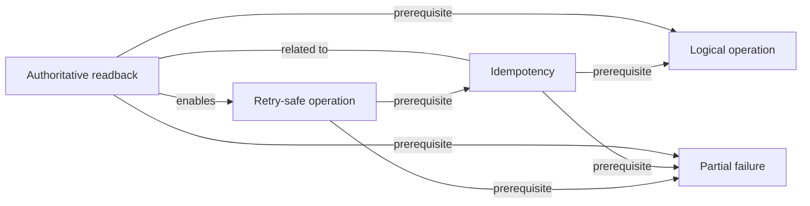

# Concept: Authoritative readback

> [!WARNING]
> Generated from the validated normalized knowledge graph. Do not edit this file directly.
> Regenerate with `python3 scripts/render-knowledge-map-markdown.py`.

Recovering an uncertain operation by checking durable authoritative state through its stable identity.

## Status

- Kind: `mechanism`
- Mastery: `mastered`
- Effective evidence: [learning record](../../learning-records/bioinformatics-systems/20260819-system-success-flow-boundaries-mastered.md)

## Direct relationships

- Prerequisite: [Logical operation](../../concepts/logical-operation.md), [Partial failure](../../concepts/partial-failure.md)
- Enables: [Retry-safe operation](../../concepts/retry-safe-operation.md)
- Contrasts with: None.
- Related to: [Idempotency](../../concepts/idempotency.md)

## Incoming relationships

No concepts directly point to this concept.

## Tracks

- [Bioinformatics Systems](../tracks/bioinformatics-systems.md)
- [Scientific AI Platforms](../tracks/scientific-ai-platforms.md)

## Case labs

No explicitly evidenced case-lab memberships.

## Linked learning artifacts

- [system-success-flows-and-ambiguous-outcomes](../../lessons/bioinformatics-systems/system-success-flows-and-ambiguous-outcomes.md)
- [20260819-system-success-flow-boundaries-mastered](../../learning-records/bioinformatics-systems/20260819-system-success-flow-boundaries-mastered.md)

## Typed local graph

Back to [Knowledge Map](../README.md).
