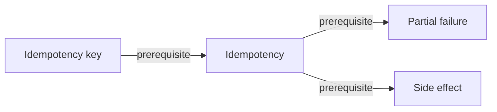

# Concept: Idempotency

> [!WARNING]
> Generated from the validated normalized knowledge graph. Do not edit this file directly.
> Regenerate with `python3 scripts/render-knowledge-map-markdown.py`.

Repeating one logical operation preserves its intended final effect.

## Status

- Kind: `foundation`
- Reviewed capability: `unassessed`
- Demonstrated at: `not reviewed`
- Legacy filename label: `mastered`
- Effective reviewed record: none.

## Direct relationships

- Prerequisite: [Partial failure](../../concepts/partial-failure.md), [Side effect](../../concepts/side-effect.md)
- Enables: None.
- Contrasts with: None.
- Related to: None.

## Incoming relationships

- [Idempotency key](../../concepts/idempotency-key.md) depends on this concept.

## Tracks

- [Scientific AI Platforms](../tracks/scientific-ai-platforms.md)

## Case labs

No explicitly evidenced case-lab memberships.

## Linked learning artifacts

No linked lessons.
- [0016-idempotency-foundations-mastered](../../learning-records/scientific-ai-platforms/0016-idempotency-foundations-mastered.md)

## Typed local graph

Back to [Knowledge Map](../README.md).
