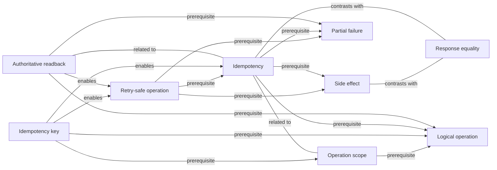

# Concept: Idempotency

> [!WARNING]
> Generated from the validated normalized knowledge graph. Do not edit this file directly.
> Regenerate with `python3 scripts/render-knowledge-map-markdown.py`.

Repeating one logical operation preserves its intended final effect.

## Status

- Kind: `foundation`
- Mastery: `mastered`
- Effective evidence: [learning record](../../learning-records/scientific-ai-platforms/0016-idempotency-foundations-mastered.md)

## Direct relationships

- Prerequisite: [Logical operation](../../concepts/logical-operation.md), [Partial failure](../../concepts/partial-failure.md), [Side effect](../../concepts/side-effect.md)
- Enables: None.
- Contrasts with: [Response equality](../../concepts/response-equality.md)
- Related to: [Authoritative readback](../../concepts/authoritative-readback.md), [Operation scope](../../concepts/operation-scope.md)

## Incoming relationships

- [Idempotency key](../../concepts/idempotency-key.md) enables this concept.
- [Retry-safe operation](../../concepts/retry-safe-operation.md) depends on this concept.

## Tracks

- [Scientific AI Platforms](../tracks/scientific-ai-platforms.md)

## Case labs

No explicitly evidenced case-lab memberships.

## Linked learning artifacts

No linked lessons.
- [0016-idempotency-foundations-mastered](../../learning-records/scientific-ai-platforms/0016-idempotency-foundations-mastered.md)

## Typed local graph

Back to [Knowledge Map](../README.md).
