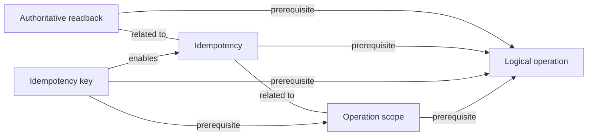

# Concept: Logical operation

> [!WARNING]
> Generated from the validated normalized knowledge graph. Do not edit this file directly.
> Regenerate with `python3 scripts/render-knowledge-map-markdown.py`.

The user-intended unit of work, which can require more than one transport request or execution attempt.

## Status

- Kind: `foundation`
- Mastery: `mastered`
- Effective evidence: [learning record](../../learning-records/scientific-ai-platforms/0016-idempotency-foundations-mastered.md)

## Direct relationships

- Prerequisite: None.
- Enables: None.
- Contrasts with: None.
- Related to: None.

## Incoming relationships

- [Authoritative readback](../../concepts/authoritative-readback.md) depends on this concept.
- [Idempotency](../../concepts/idempotency.md) depends on this concept.
- [Idempotency key](../../concepts/idempotency-key.md) depends on this concept.
- [Operation scope](../../concepts/operation-scope.md) depends on this concept.

## Tracks

- [Scientific AI Platforms](../tracks/scientific-ai-platforms.md)

## Case labs

No explicitly evidenced case-lab memberships.

## Linked learning artifacts

No linked lessons.
- [0016-idempotency-foundations-mastered](../../learning-records/scientific-ai-platforms/0016-idempotency-foundations-mastered.md)

## Typed local graph

Back to [Knowledge Map](../README.md).
