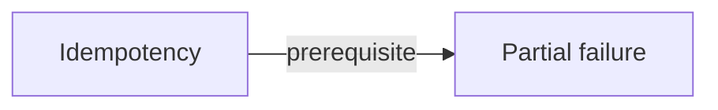

# Concept: Partial failure

> [!WARNING]
> Generated from the validated normalized knowledge graph. Do not edit this file directly.
> Regenerate with `python3 scripts/render-knowledge-map-markdown.py`.

A distributed operation can have some effects occur while another participant cannot determine the final outcome.

## Status

- Kind: `foundation`
- Reviewed capability: `unassessed`
- Demonstrated at: `not reviewed`
- Legacy filename label: `not started`
- Effective reviewed record: none.

## Direct relationships

- Prerequisite: None.
- Enables: None.
- Contrasts with: None.
- Related to: None.

## Incoming relationships

- [Idempotency](../../concepts/idempotency.md) depends on this concept.

## Tracks

- [Bioinformatics Systems](../tracks/bioinformatics-systems.md)
- [Scientific AI Platforms](../tracks/scientific-ai-platforms.md)

## Case labs

No explicitly evidenced case-lab memberships.

## Linked learning artifacts

No linked lessons.
No linked learning records.

## Typed local graph

Back to [Knowledge Map](../README.md).
