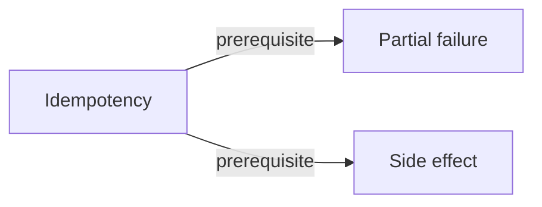

# Bounded Knowledge Overview

> [!WARNING]
> Generated from the validated normalized knowledge graph. Do not edit this file directly.
> Regenerate with `python3 scripts/render-knowledge-map-markdown.py`.

This global spine intentionally includes only orientation and foundation concepts.
Use a track, case-lab, or focal page for a more complete local view.

## Dependency spine

## Concepts

| Concept | Kind | Mastery | Summary |
| --- | --- | --- | --- |
| [Idempotency](../concepts/idempotency.md) | foundation | mastered | Repeating one logical operation preserves its intended final effect. |
| [Partial failure](../concepts/partial-failure.md) | foundation | not started | A distributed operation can have some effects occur while another participant cannot determine the final outcome. |
| [Side effect](../concepts/side-effect.md) | foundation | mastered | An observable change to execution or its environment caused by evaluation or an operation. |

Back to [Knowledge Map](README.md).
