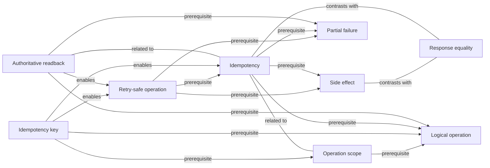

# Track: Scientific AI Platforms

> [!WARNING]
> Generated from the validated normalized knowledge graph. Do not edit this file directly.
> Regenerate with `python3 scripts/render-knowledge-map-markdown.py`.

Direct concepts are explicitly taught or reused by this track. Contextual concepts are one-hop prerequisites only.

## Direct concepts

| Concept | Kind | Mastery | Summary |
| --- | --- | --- | --- |
| [Authoritative readback](../../concepts/authoritative-readback.md) | mechanism | mastered | Recovering an uncertain operation by checking durable authoritative state through its stable identity. |
| [Idempotency](../../concepts/idempotency.md) | foundation | mastered | Repeating one logical operation preserves its intended final effect. |
| [Idempotency key](../../concepts/idempotency-key.md) | pattern | mastered | A stable identifier retained across attempts for one scoped logical operation. |
| [Logical operation](../../concepts/logical-operation.md) | foundation | mastered | The user-intended unit of work, which can require more than one transport request or execution attempt. |
| [Operation scope](../../concepts/operation-scope.md) | boundary | mastered | The operation type or namespace within which an idempotency key identifies one logical operation. |
| [Partial failure](../../concepts/partial-failure.md) | foundation | not started | A distributed operation can have some effects occur while another participant cannot determine the final outcome. |
| [Response equality](../../concepts/response-equality.md) | boundary | mastered | The property that repeated attempts return identical response representations. |
| [Retry-safe operation](../../concepts/retry-safe-operation.md) | pattern | mastered | An operation that can be attempted again after an uncertain response without duplicating its intended side effects. |
| [Side effect](../../concepts/side-effect.md) | foundation | mastered | An externally observable state change caused by an operation. |

## One-hop prerequisite context

No concepts match this view.

## Typed relationships

Back to [Knowledge Map](../README.md).
